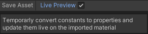

# Live Preview

Live Preview updates all constant properties like Color, Float while working on the shader for preview in the scene view.
It only works with the imported material subasset.
This is similar to shader locking or baking which optimizes the shader by reducing the need for material properties.

## Enable

Toggle on live preview next to the Save Asset Button.
Make sure to disable it at the end more a more optimized shader.

## Example

